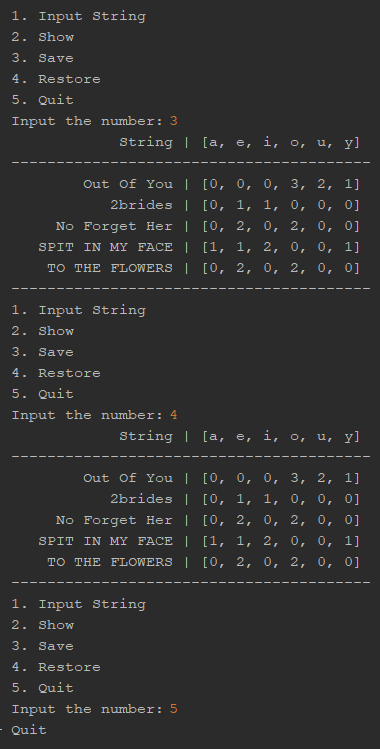
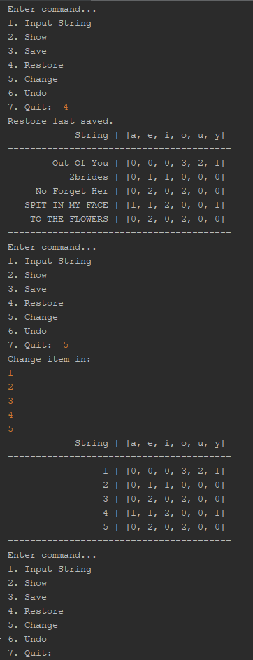

# Практика ООП

## Завдання 1 (01.03.24)

- Створити репозиторій
- Написати просту консольну програму

## Завдання 2 (04.03.24)
- Розробити клас, що серіалізується, для зберігання параметрів і результатів обчислень. Використовуючи агрегування, розробити клас для знаходження рішення задачі.
- Розробити клас для демонстрації в діалоговому режимі збереження та відновлення стану об'єкта, використовуючи серіалізацію. Показати особливості використання transient полів.
- Розробити клас для тестування коректності результатів обчислень та серіалізації/десеріалізації.
- Виконати індивідуальне завдання згідно номеру в списку.

## Завдання 3 (05.03.24)

- Як основа використовувати вихідний текст проекту попередньої лабораторної роботи. Забезпечити розміщення результатів обчислень уколекції з можливістю збереження/відновлення.
- Використовуючи шаблон проектування Factory Method (Virtual Constructor), розробити ієрархію, що передбачає розширення рахунок додавання нових відображуваних класів.
- Розширити ієрархію інтерфейсом "фабрикованих" об'єктів, що представляє набір методів для відображення результатів обчислень.
- Реалізувати ці методи виведення результатів у текстовому виде.
- Розробити тареалізувати інтерфейс для "фабрикуючого" методу.

     

## Завдання 4 (06.03.24)

- За основу використовувати вихідний текст проекту попередньої лабораторної роботи Використовуючи шаблон проектування Factory Method (Virtual Constructor), розширити ієрархію похідними класами, реалізують методи для подання результатів у вигляді текстової таблиці. Параметри відображення таблиці мають визначатися користувачем.
- Продемонструвати заміщення (перевизначення, overriding), поєднання (перевантаження, overloading), динамічне призначення методів (Пізнє зв'язування, поліморфізм, dynamic method dispatch).
- Забезпечити діалоговий інтерфейс із користувачем.
- Розробити клас для тестування основної функціональності.
- Використати коментарі для автоматичної генерації документації засобами javadoc.

   

## Завдання 5 (07.03.24)

- Реалізувати можливість скасування (undo) операцій (команд).
- Продемонструвати поняття "макрокоманда"
- При розробці програми використовувати шаблон Singletone.
- Забезпечити діалоговий інтерфейс із користувачем.
- Розробити клас для тестування функціональності програми.

## Завдання 6 (08.03.24)
- Продемонструвати можливість паралельної обробки елементів колекції (пошук мінімуму, максимуму, обчислення середнього значення, відбір за критерієм, статистична обробка тощо).
- Управління чергою завдань (команд) реалізувати за допомогою шаблону Worker Thread.

 

## Завдання 7 (11.03.24)
- Розробити ієрархію класів відповідно до шаблону Observer (java) та продемонструвати можливість обслуговування розробленої раніше колекції (об'єкт, що спостерігається, Observable) різними (не менше двох) спостерігачами (Observers) – відстеження змін, упорядкування, висновок, відображення і т.д.
- При реалізації ієрархії класів використати інструкції (Annotation). Відзначити особливості різних політик утримання анотацій (annotation retention policies). Продемонструвати підтримку класів концепції рефлексії (Reflection).
- Використовуючи раніше створені класи, розробити додаток, що відображає результати обробки колекції об'єктів у графічному вигляді
- Забезпечити діалоговий інтерфейс з користувачем та перемальовування графіка під час зміни значень елементів колекції.

