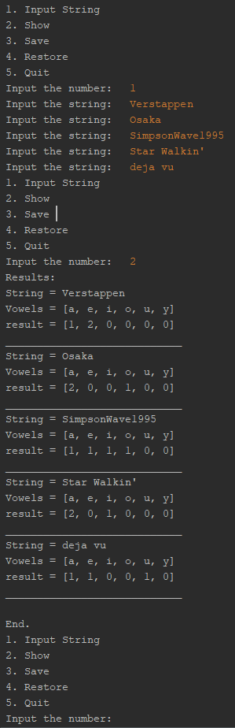

# Практика ООП

## Завдання 1 (01.03.24)

- Створити репозиторій
- Написати просту консольну програму

## Завдання 2 (04.03.24)
- Розробити клас, що серіалізується, для зберігання параметрів і результатів обчислень. Використовуючи агрегування, розробити клас для знаходження рішення задачі.
- Розробити клас для демонстрації в діалоговому режимі збереження та відновлення стану об'єкта, використовуючи серіалізацію. Показати особливості використання transient полів.
- Розробити клас для тестування коректності результатів обчислень та серіалізації/десеріалізації.
- Виконати індивідуальне завдання згідно номеру в списку.

## Завдання 3 (04.03.24)

- Як основа використовувати вихідний текст проекту попередньої лабораторної роботи. Забезпечити розміщення результатів обчислень уколекції з можливістю збереження/відновлення.
- Використовуючи шаблон проектування Factory Method (Virtual Constructor), розробити ієрархію, що передбачає розширення рахунок додавання нових відображуваних класів.
- Розширити ієрархію інтерфейсом "фабрикованих" об'єктів, що представляє набір методів для відображення результатів обчислень.
- Реалізувати ці методи виведення результатів у текстовому виде.
- Розробити тареалізувати інтерфейс для "фабрикуючого" методу.

     
